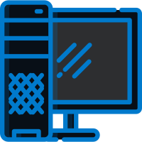

<h1 align="center">
  
   
  Remote Control Server
</h1>

**Remote Control Server** is a Windows desktop application which together with [Remote Control Client](https://github.com/Tum4ik/remote-control-client) provides a possibility to control your PC via smartphone.

## Features
* Mouse actions control
* System volume control

## Screenshots
### Tray Menu

### Settings Window

### About Window

